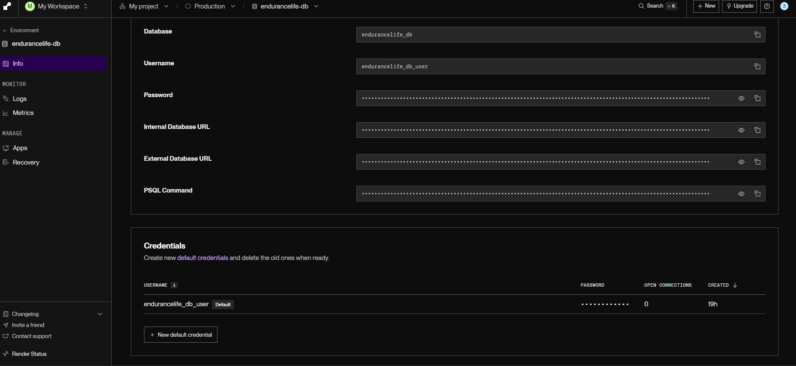
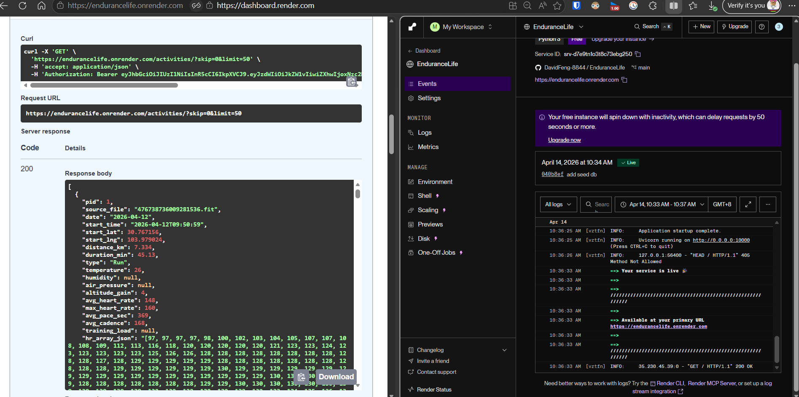

# EnduranceLife API 🏃‍♂️🚴‍♀️

A robust RESTful API for managing endurance-sport training data, daily nutrition/recovery metrics, and physiological trend tracking. Built with **Python**, **FastAPI**, **SQLAlchemy**, and **Pydantic V2**. Designed for high-performance cloud deployment with a Zero-Trust data isolation architecture.

[](#)
[](#)
[](#)

## 🚀 Live Demo & Documentation

The API is fully deployed on the Render cloud, powered by a persistent PostgreSQL database. 
Render.com free tier web services typically take 30 to 60 seconds to wake up from a cold start.

| Resource | Link |
|---|---|
| **Live Swagger UI** | **[https://endurancelife.onrender.com/docs](https://endurancelife.onrender.com/docs)** |
| **Live ReDoc** | **[https://endurancelife.onrender.com/redoc](https://endurancelife.onrender.com/redoc)** |
| Technical Report | [`docs/technical_report.pdf`](docs/technical_report.pdf) |
| API Documentation (ReDoc export) | [`docs/api_documentation.pdf`](docs/api_documentation.pdf) |

> **🔑 Examiner Demo Login**: 
> The cloud database is pre-seeded with realistic lifetime training data (activities, PRs, body metrics). To fully explore the secure endpoints, click the global **Authorize 🔒** button at the top-right of the Swagger page and use:
> - **Username**: `demo`
> - **Password**: `endurance2026`
> 
> *(Testing Tip: Always use the green Authorize button to log in instead of manually testing the `POST /auth/login` endpoint block. The Authorize button automatically stores the stateless JWT Bearer Token in memory and seamlessly injects it into all future requests.)*

### Proof of Deployment
Below is the evidence of the API successfully operating in the Render cloud production environment alongside its connected PostgreSQL instance:
<p float="left">
  
  
</p>


## Project Structure

```
EnduranceLife/
├── requirements.txt             # Python dependencies
├── README.md                    # This file
├── app/                         # Core API package
│   ├── __init__.py
│   ├── main.py                  # App entry point -- init & router registration
│   ├── database.py              # SQLAlchemy engine & session (PostgreSQL / SQLite)
│   ├── models.py                # ORM table definitions (User, Activity, etc.)
│   ├── schemas.py               # Pydantic request/response models
│   ├── auth.py                  # JWT authentication utilities (bcrypt + python-jose)
│   └── routers/
│       ├── __init__.py
│       ├── auth.py              # Register, login, logout, /me
│       ├── activity.py          # CRUD for workout activities + .fit upload
│       ├── daily_metric.py      # CRUD for daily nutrition & recovery
│       ├── physiology.py        # CRUD for physiological snapshots
│       └── analytics.py         # Dashboard-facing analytics endpoints
├── tests/                       # Comprehensive test suite (pytest)
│   ├── conftest.py              # Fixtures: in-memory DB, TestClient, sample data
│   ├── test_auth.py             # Auth: register, login, logout, token tests (14 tests)
│   ├── test_activity.py         # Activity CRUD + .fit upload tests (19 tests)
│   ├── test_daily_metric.py     # DailyMetric CRUD + by-date update (14 tests)
│   ├── test_physiology.py       # PhysiologyLog CRUD tests (13 tests)
│   └── test_analytics.py        # All 5 analytics endpoints (20 tests)
├── scripts/                     # Standalone data-pipeline scripts
│   ├── __init__.py
│   ├── import_fit.py            # Parse Coros .fit files → Activity table
│   ├── enrich_weather.py        # Backfill weather data via Open-Meteo API
│   ├── seed_daily_metrics.py    # Generate simulated DailyMetric records
│   └── seed_physiology.py       # Generate trending PhysiologyLog records
└── data/
    └── coros/                   # Drop .fit files here for import
```

## Quick Start

```bash
# 1. Create and activate a virtual environment
python -m venv venv
source venv/bin/activate        # Linux / macOS
venv\Scripts\activate           # Windows

# 2. Install dependencies
pip install -r requirements.txt

# 3. Run the development server
uvicorn app.main:app --reload
```

The API will be available at **http://127.0.0.1:8000**.

By default (no `DATABASE_URL` env var), the app uses a local **SQLite** file `endurance_life.db`. Set `DATABASE_URL` to a PostgreSQL connection string for production.

## Deployment (Render.com)

### 1. Create a PostgreSQL Database

1. Go to [Render Dashboard](https://dashboard.render.com/) → **New** → **PostgreSQL**
2. Fill in a name (e.g. `endurancelife-db`), select the **Free** plan, click **Create**
3. Copy the **Internal Database URL** (starts with `postgresql://...`)

### 2. Create a Web Service

1. **New** → **Web Service** → connect your GitHub repo
2. Configure:
   - **Runtime**: Python
   - **Build Command**: `pip install -r requirements.txt`
   - **Start Command**: `python -m scripts.seed_db && uvicorn app.main:app --host 0.0.0.0 --port $PORT`
3. Add **Environment Variable**:
   - `DATABASE_URL` = *(paste the Internal Database URL from step 1)*
4. Click **Deploy**

The app auto-detects `DATABASE_URL` at startup. Automatically running `seed_db` in the start command guarantees that even if the database is destroyed or reset, the environment perfectly regenerates all historical activities and analytics for the `demo` user upon startup.

## Testing

The project includes a comprehensive test suite (80 tests) powered by **pytest**. All tests run against an **in-memory SQLite database** -- zero impact on production data.

```bash
# Run the full suite
python -m pytest tests/ -v

# Run a specific test file
python -m pytest tests/test_activity.py -v

# Run with coverage (requires pytest-cov)
python -m pytest tests/ --cov=app --cov-report=term-missing
```

| Test File | Tests | Coverage |
|---|---|---|
| `test_auth.py` | 14 | Register (success/dup/validation), login (success/wrong/missing), token (/me valid/invalid/none), logout (success/blacklist/re-login/no-token) |
| `test_activity.py` | 19 | CRUD + .fit upload + duplicate 409 + date filters + pagination |
| `test_daily_metric.py` | 14 | CRUD + by-date update + validation + duplicate 409 |
| `test_physiology.py` | 13 | CRUD + JSON zone handling |
| `test_analytics.py` | 20 | All 5 analytics endpoints: trends, PRs, training status, environment, lifestyle |

## Data Tables


| Table            | Purpose                                    | Key Constraint                        |
|------------------|--------------------------------------------|---------------------------------------|
| `activities`     | Workout records from .fit files            | Unique `source_file`                  |
| `daily_metrics`  | Daily nutrition, sleep & recovery logging  | Unique `(pid, date)` composite index  |
| `physiology_logs`| Body-state snapshots for trend charts      | Unique `(pid, date)` composite index  |

## Data Pipeline Scripts

The `scripts/` directory contains standalone Python modules for populating and enriching the database. All scripts are run as modules from the project root.

### 1. Import .fit Files

Parses Coros-exported `.fit` files using `fitdecode` and inserts them into the `Activity` table. Handles non-standard Coros field sizing, converts units (m->km, s->min, semicircles->degrees), and extracts HR/pace time-series as JSON arrays. Duplicate files are detected via an in-memory `source_file` set, and inserts use **batch commits** (default 30 records per commit, 10 on Render) to minimize network round-trips to remote databases.

```bash
python -m scripts.import_fit                        # default: pid=1, data/coros/
python -m scripts.import_fit --pid 2 --dir data/other_watch/
python -m scripts.import_fit --batch-size 50         # custom batch size
```

### 2. Enrich Weather Data

Backfills `temperature`, `humidity`, and `air_pressure` for Activity records using the [Open-Meteo Historical Weather API](https://open-meteo.com/en/docs/historical-weather-api). Queries activities that have GPS coordinates but no weather data (idempotent). Matches the hourly weather slot to the activity's `start_time`. DB writes are batched every 20 records.

```bash
python -m scripts.enrich_weather                    # default: 500 records, 0.01s delay
python -m scripts.enrich_weather --batch-size 100   # limit batch size
python -m scripts.enrich_weather --delay 0.5        # slower for rate-limit safety
```

### 3. Seed Daily Metrics (Simulated)

Generates realistic mock `DailyMetric` records for every distinct activity date. Values (sleep, fatigue, calories, recovery, etc.) are correlated with that day's training volume. Uses **batch commits** (50 per flush) and in-memory duplicate detection for fast remote DB population.

```bash
python -m scripts.seed_daily_metrics            # all users
python -m scripts.seed_daily_metrics --pid 1    # specific user
```

### 4. Seed Physiology Logs (Simulated)

Generates bi-weekly `PhysiologyLog` snapshots from the user's first activity date to today with cumulative fitness progression: VO2Max gradually rises, resting HR drops, weight trends down, and threshold HR/pace zones are recalculated at each snapshot. Uses **batch commits** (50 per flush).

```bash
python -m scripts.seed_physiology               # default: pid=1
python -m scripts.seed_physiology --pid 2
```

## API Endpoints

### Authentication (`/auth`)

> **Demo User (pid=1)**: The database is pre-populated with realistic lifetime training data (activities, PRs, physiology updates) linked to `pid=1`. For testing and grading, log in with these credentials to access the populated dashboard data:
> - **Username**: `demo`
> - **Password**: `endurance2026`

- `POST /auth/register` -- Create a new user (username + password, 409 on duplicate)
- `POST /auth/login` -- Authenticate and receive a JWT Bearer token (30 min expiry)
- `POST /auth/logout` -- Invalidate the current token (requires auth)
- `GET /auth/me` -- Get current user profile (requires auth)

> **🔒 Zero-Trust Data Isolation**: All endpoints matching `/activities`, `/daily-metrics`, `/physiology`, and `/analytics` are strictly protected by a `get_current_user` JWT dependency. The system entirely ignores any `pid` submitted by the client (preventing IDOR vulnerabilities) and dynamically scopes all database interactions directly to the authenticated user's ID.

### CRUD -- Activities (`/activities`)
The activities module forms the bedrock of objective training datastore:
- `POST /activities/` -- Create via JSON body (409 on duplicate `source_file`)
- `POST /activities/upload` -- **FIT File Ingestion**: Parses binary `.fit` files via `fitdecode`. Iterates through data frames to extract start/end bounds, distance, ascent, and dynamically computes averages (HR, pace). It maps these strictly to the `Activity` SQLAlchemy ORM.
- `GET /activities/` -- List (Implements query-level limits to prevent memory overflow: filter by `pid`, `type`, `date_from`, `date_to`; paginate with `skip`, `limit`)
- `GET /activities/{id}` -- Get one
- `PUT /activities/{id}` -- Partial update
- `DELETE /activities/{id}` -- Delete

### CRUD -- Daily Metrics (`/daily-metrics`)
Handles subjective inputs and lifestyle context for analytics:
- `POST /daily-metrics/` -- Create (409 on duplicate `pid` + `date`)
- `GET /daily-metrics/` -- List (filter by `pid`, `date_from`, `date_to`)
- `GET /daily-metrics/{id}` -- Get one
- `PUT /daily-metrics/{id}` -- Partial update by ID
- `PUT /daily-metrics/by-date` -- **Composite-Key Update**: Smart upsert pattern by `pid` + `date`. Allows frontends to submit ``today's updates`` directly without querying the internal row `id` first.
- `DELETE /daily-metrics/{id}` -- Delete

### CRUD -- Physiology Logs (`/physiology`)
Simulates periodized biometric testing (e.g., lab fitness tests or smartwatch baseline updates):
- `POST /physiology/` -- Create (requires thresholds and JSON zones)
- `GET /physiology/` -- List (filter by `pid`)
- `GET /physiology/{id}` -- Get one
- `PUT /physiology/{id}` -- Partial update
- `DELETE /physiology/{id}` -- Delete

### Analytics -- Dashboard Endpoints (`/analytics`)

Chart-ready, strongly-typed endpoints designed to offload grouping and computational math to the PostgreSQL layer.

| Endpoint | Purpose | Implemented Logic \& Principle |
|---|---|---|
| `GET /analytics/physiology/trends` | Line chart data & Predictions | Uses the Daniels VO2-velocity formula combined with recent valid VO2Max logs to mathematically predict 5K/10K/HM limits utilizing sustained pacing ratios (~95% VO2 for 5k). |
| `GET /analytics/performance/records` | PR trophy display | Queries fast completion times mapped to fixed distance buckets (Run: 5K/10K/HM). Strictly implements **anomaly filtering** to exclude GPS glitched pacing (e.g. discarding paces faster than 2:30/km). |
| `GET /analytics/training/status` | Calendar & Load charts | Aggregates daily distance and computes intensity distribution buckets (Easy / Tempo / Hard) based on grouping HR thresholds dynamically. |
| `GET /analytics/insights/environment` | Temperature impact | Applies SQLAlchemy `case()` statements to bucket activities into Cold (<$10^{\circ}$C), Moderate ($10-22^{\circ}$C), and Hot (>$22^{\circ}$C), computing SQL `func.avg()` HR per-bucket to illustrate cardiovascular drift. |
| `GET /analytics/insights/lifestyle` | Sleep & fatigue correlation | Cross-references (`JOIN`) activities against `daily_metrics` utilizing date equivalence to compare pacing & HR directly against sleep tiers ($<$6h poor vs $>$7h good). |
